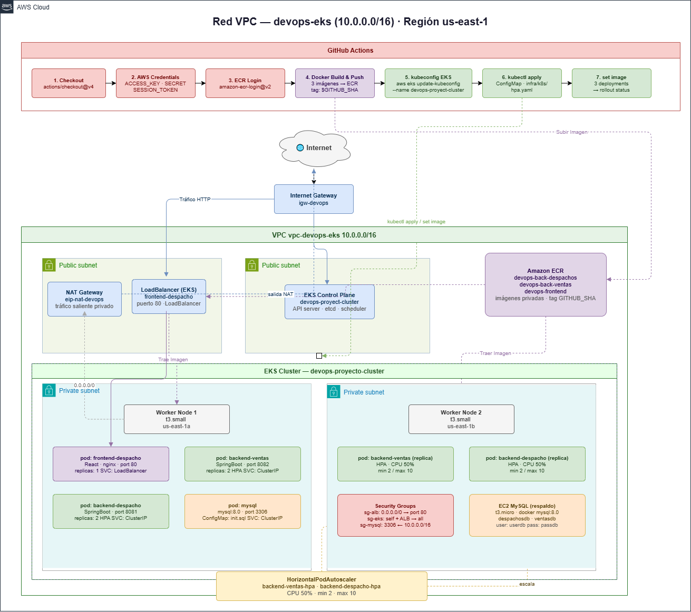

# Proyecto DevOps - Etapas 2 y 3: CI/CD, Contenedorización y EKS

## Descripción del Proyecto
Este proyecto consiste en la implementación de una arquitectura de microservicios robusta y automatizada para la empresa Innovatech Chile. El objetivo principal es realizar la transición de una infraestructura tradicional hacia un modelo DevOps, utilizando la contenedorización con Docker para asegurar la portabilidad, Kubernetes (AWS EKS) para la orquestación y GitHub Actions para automatizar el ciclo de vida del software mediante pipelines de Integración y Despliegue Continuo (CI/CD).

La solución despliega un stack tecnológico compuesto por un Frontend desarrollado en React y dos microservicios de Backend (Ventas y Despachos) en Spring Boot, integrados con una base de datos MySQL con persistencia de datos.

---

## 🏗️ Arquitectura en AWS (Diagrama)


 

---

## 🚀 Etapa 1: Experiencia 2 (CI/CD Básico y ECS)

En esta etapa se implementaron los pipelines básicos de CI/CD y la infraestructura inicial.

### Componentes de la Etapa 1:
* **Pipelines CI/CD (`.github/workflows/experiencia_2/`)**:
  * `ci.yml`: Pipeline de integración continua que ejecuta pruebas y construye la aplicación para el Frontend y los Backends.
  * `cd.yml`: Pipeline de despliegue continuo automatizado hacia Amazon ECS.
* **Infraestructura (`infra/exp2/`)**:
  * `main.tf`: Archivo de código de Terraform con la definición de la infraestructura inicial.

### Automatización CI/CD (Experiencia 2)
Se configuraron pipelines en GitHub Actions que se activan automáticamente:
1. **Build:** Construcción de imágenes Docker utilizando las mejores prácticas y empaquetado multi-plataforma (`linux/amd64`).
2. **Registry:** Publicación automática de imágenes en repositorios de **AWS ECR**.
3. **Deploy:** Actualización automatizada de los servicios ECS.

---

## 🚀 Etapa 2: Experiencia 3 (Migración a EKS y Terraform Avanzado)

En esta etapa se migró la orquestación a un cluster gestionado de Kubernetes en la nube mediante **AWS EKS** y se modularizó la infraestructura como código.

### Componentes de la Etapa 2:
* **Pipeline CD EKS (`.github/workflows/cd.yml`)**: Despliegue continuo hacia el cluster de Kubernetes AWS EKS.
* **Infraestructura EKS y Redes (`infra/terraform/`)**: Configuración modularizada de Terraform (VPC, EKS, ECR, EC2, Security Groups, etc.).
* **Manifiestos Kubernetes (`infra/k8s/`)**: Definición de Deployments, Services y ConfigMaps para el frontend, los backends y la base de datos MySQL.

### Arquitectura de la Solución (EKS)
La infraestructura se ha diseñado bajo principios de seguridad y escalabilidad en AWS:
* **Redes:** Se utiliza una VPC dedicada (`despacho-ventas-vpc`) con subredes públicas distribuidas en diferentes zonas de disponibilidad para cumplir con la alta disponibilidad requerida por AWS EKS.
* **Seguridad:** Implementación de Security Groups personalizados que restringen el tráfico del plano de control, aislando la lógica de negocio y aplicando el principio de mínimo privilegio.
* **Contenedorización:** Uso de Dockerfiles multi-stage para optimizar el tamaño de las imágenes, mejorar el rendimiento y garantizar la seguridad mediante usuarios no root.
* **Orquestación:** Migración de entornos locales hacia un Cluster gestionado de Kubernetes en la nube mediante **AWS EKS** (`devops-proyect-cluster`).

### Guía de Despliegue en AWS (Experiencia 3)

A continuación, los comandos manuales equivalentes al pipeline para compilar, subir y desplegar la aplicación completa en la infraestructura de AWS EKS.

1. **Construcción y subida de imágenes a ECR**:
```bash
# Autenticarse en ECR
aws ecr get-login-password --region us-east-1 | docker login --username AWS --password-stdin <tu-account-id>.dkr.ecr.us-east-1.amazonaws.com 

# Compilar y subir imágenes usando buildx para compatibilidad (amd64)
docker buildx build --platform linux/amd64 -t <tu-account-id>.dkr.ecr.us-east-1.amazonaws.com/devops-back-despachos:latest ./backend/back-Despachos_SpringBoot/Springboot-API-REST-DESPACHO --push

docker buildx build --platform linux/amd64 -t <tu-account-id>.dkr.ecr.us-east-1.amazonaws.com/devops-back-ventas:latest ./backend/back-Ventas_SpringBoot/Springboot-API-REST --push

docker buildx build --platform linux/amd64 -t <tu-account-id>.dkr.ecr.us-east-1.amazonaws.com/devops-frontend:latest ./front_despacho --push
```

2. **Despliegue en Kubernetes (EKS)**:
```bash
# Actualizar contexto de kubectl
aws eks update-kubeconfig --region us-east-1 --name devops-proyect-cluster

# Verificar conexión (Debe listar los nodos de AWS en estado Ready)
kubectl get nodes

# Crear ConfigMap para inicializar la base de datos MySQL
kubectl create configmap mysql-init-config --from-file=./mysql-init/init.sql

# Aplicar manifiestos de Kubernetes
kubectl apply -f infra/k8s/

# Verificar despliegue de los Pods y Servicios
kubectl get pods
kubectl get svc
```